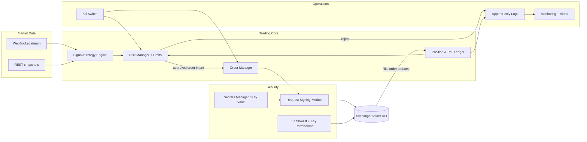

# Building a $50 Autonomous Trading Agent for Crypto or Stocks

## Executive summary

An “autonomous AI trading agent” funded with **$50** is realistically a **systems engineering + risk control exercise**, not a reliable way to compound capital in a statistically meaningful way (fees, spreads, and variance dominate at this scale). The right goal is to build a **safe, auditable, kill-switchable execution system** that can (a) backtest and paper trade, (b) trade live with strict guardrails, and (c) measure whether *any* signal has edge after costs and slippage. The most sustainable architecture is **not** “LLM decides trades,” but rather a **deterministic trading engine** where any AI component is sandboxed into bounded roles (feature engineering, strategy research, parameter suggestions) and cannot bypass risk limits.

For crypto, large exchanges expose REST + WebSocket APIs with signed requests and clear rate limiting. For a $50 experiment, you should prioritize: (1) availability in your jurisdiction, (2) a credible sandbox/testnet or paper environment, (3) robust key security (IP allowlists, no-withdraw permissions), (4) simple order types (market/limit) plus explicit stop logic, and (5) low fixed overhead and monitoring. Binance spot provides a mature testnet plus well-documented signing and rate-limit behavior, including automated IP bans if you ignore 429 backoffs. citeturn1search3turn22view0turn23view0 OKX provides a demo trading mode with a dedicated header and region-specific endpoints and documents headers/signing and rate-limit error codes. citeturn11view0turn12view1turn12view4 Coinbase Advanced Trade uses short-lived JWT auth for REST/WebSocket and offers a **static, mocked** sandbox (good for integration testing, not realistic paper fills). citeturn15view1turn13view2turn14view0

For stocks, $50 collides with practical constraints: in the entity["country","United States","country"], retail **pattern day trading** rules require **$25,000 minimum equity** in a margin account to day trade under current rules, though entity["organization","FINRA","us self-regulator"] has filed a proposal (January 7, 2026) to replace existing PDT provisions and eliminate the $25k threshold—i.e., it is **in flux** and you must verify current enforcement at your broker. citeturn27search0turn27search4turn27search24 With $50, stocks typically make more sense as **low-frequency**, likely **cash account** trading (settlement constraints) rather than day trading.

Across crypto or stocks, legal/regulatory risk concentrates in (a) **jurisdictional restrictions** and platform terms, (b) potential “advice/managed accounts” classification if you trade for others, and (c) manipulative behavior (e.g., spoofing) that can occur unintentionally with poorly designed bots. The safest operating posture is: trade only your own account, avoid leverage and derivatives, keep withdrawal permissions disabled, implement pre-trade risk checks, enforce daily loss limits, and include a mechanical rollback path (cancel open orders → flatten positions → revoke keys).

## Legal, regulatory, custodial, and ethical constraints

Autonomous trading touches law in ways most hobby projects don’t—because your code can place financial orders at machine speed and “oops” is not a compliance strategy.

### Personal account vs. “managed money” and advice risk

If you are trading **only your own funds**, you generally avoid the most complex registration regimes applicable to advisers/managers. The line is crossed when you trade **other people’s accounts**, accept compensation for advice/signals, or run pooled money—concepts that can trigger investment adviser or similar obligations. The entity["organization","U.S. Securities and Exchange Commission","us securities regulator"] explains that firms within the definition of “investment adviser” generally must register (subject to exclusions/exemptions), and anti-fraud provisions apply broadly. citeturn27search1turn27search25  
Practical takeaway: keep this project strictly **personal**, don’t market it as a product, and don’t accept third-party funds unless you obtain qualified legal counsel.

### Market integrity and manipulative behavior

Bots can accidentally produce behavior regulators interpret as manipulative (quote stuffing, wash trading, or “spoof-like” patterns). Spoofing—bidding/offering with intent to cancel before execution—has been specifically prohibited in US derivatives markets since Dodd-Frank and is defined in legal literature as “bidding or offering with the intent to cancel … before execution.” citeturn27search19turn27search15  
Practical takeaway: never implement strategies that rely on placing orders you *intend* to cancel to move price; avoid tactics that create false depth, and rate-limit your own order modifications.

### Jurisdiction and platform access

Exchange/broker access is jurisdiction-dependent. Binance states it changed its terms to **prohibit U.S. users** on Binance.com around the time Binance.US launched. citeturn4search20 OKX publishes restrictions by location and also provides US-facing risk/compliance disclosures for its US entity. citeturn3search1turn3search13  
Practical takeaway: before you code against any API, verify **you can legally open and maintain an account** where you live and that the specific product (spot, margin, derivatives) is enabled for you.

### Custody and ethical handling of keys

With API-based trading, your assets are usually held in **exchange or broker custody** (unless you’re building on-chain trading, which introduces different risks). That makes API key security the main safety problem. Good practice is least privilege: enable only what you need (often *trade* + *read*, no withdraw), lock keys to known IPs, and rotate/revoke on any suspicion.

Examples from official docs:

* Binance’s API key permission endpoints expose whether withdrawals are enabled, and Binance requires **IP restriction** to enable withdrawals. citeturn4search1turn4search5  
* OKX API keys support `Read`, `Trade`, and `Withdraw` permissions; OKX recommends binding keys to IPs and notes unbound keys with trade/withdraw can expire after inactivity. citeturn11view0  
* Coinbase CDP keys can be configured with an IP allowlist and granular permissions (e.g., ability to trade/transfer). citeturn13view1turn15view1

Ethically and operationally, treat API keys like loaded weapons: you don’t leave them on the kitchen table.

### Tax and reporting basics (general guidance, not tax advice)

Crypto is typically taxed as property in many regimes; in the US, the entity["organization","Internal Revenue Service","us tax agency"] explicitly treats “virtual currency” as **property** and applies general property tax principles; IRS FAQs expand on Notice 2014-21. citeturn27search2turn27search6  
Practical implications for an autonomous bot:

* Each fill can create a taxable event (gain/loss) depending on jurisdiction and asset class.
* You need durable records: timestamps, instrument, size, price, fees, and transfers.
* Your system should export trades to CSV and reconcile against statements.

If you later migrate to stocks, reporting is typically via broker tax forms (jurisdiction-dependent), but you still want the same internal audit trail.

## Exchange and broker API comparison

The table below emphasizes: auth/signing, order types, fees, minimums, sandbox/testnet availability, rate limits, and official docs.

| Platform | Asset class | Auth / signing | Common order types (API) | Fees (high-level) | Minimums (practical) | Sandbox / paper / testnet | Rate limits (documentation) | Official docs |
|---|---|---|---|---|---|---|---|---|
| entity["company","Binance","crypto exchange"] | Crypto (spot; other products vary) | API key via `X-MBX-APIKEY`; signed endpoints use `timestamp` + `signature` (HMAC/RSA/Ed25519 supported) citeturn19view1turn23view0 | Spot `LIMIT`, `MARKET`, `STOP_LOSS`, `STOP_LOSS_LIMIT`, `TAKE_PROFIT`, `TAKE_PROFIT_LIMIT`, `LIMIT_MAKER` (+ trailing via `trailingDelta`) citeturn22view0 | Spot fee tiers; “regular users” typically 0.1% maker/taker; BNB fee payment can discount up to 25% citeturn29search0turn29search6turn29search1 | Product-specific min size/step; enforced via symbol rules/filters (queryable via API) citeturn22view0 | Spot **testnet** REST base `https://testnet.binance.vision` and WSS `wss://stream.testnet.binance.vision/ws` citeturn1search3turn19view2 | `/api/*` endpoints share documented per-minute IP limits; 429 on limit breach and 418 IP ban if you keep spamming; WebSocket message/stream limits documented citeturn23view0turn23view1turn8search1 | Spot REST/WS docs citeturn22view0turn8search1turn19view1 |
| entity["company","Binance.US","us crypto exchange"] | Crypto (US platform) | Similar signed model (key permissions and signed requests described) citeturn4search25 | Similar spot-style order types (check platform docs) citeturn4search25 | Advertises 0% maker fees and 0.01% taker fees on Tier 0 pairs (subject to change) citeturn29search11 | Account/product minimums depend on pair and platform rules | No general “testnet” is prominent; verify in docs citeturn4search25 | Verify on Binance.US docs citeturn4search25 | Binance.US API docs citeturn4search25 |
| entity["company","OKX","crypto exchange"] | Crypto (spot + derivatives vary by region) | Private REST headers: `OK-ACCESS-KEY`, `OK-ACCESS-SIGN`, `OK-ACCESS-TIMESTAMP`, `OK-ACCESS-PASSPHRASE`; signature is Base64(HMAC_SHA256(timestamp+method+path+body)) citeturn11view0turn12view1 | Order endpoints support multiple products; demo mode available; see per-endpoint specs citeturn11view0turn12view0 | Tiered maker/taker fees (spot fee schedule varies by level) citeturn0search15 | Min size/step is instrument-specific (query instruments/config via API) citeturn8search26turn11view0 | **Demo trading**: same REST base as documented region endpoints; requires header `x-simulated-trading: 1`; some functions (withdraw, deposit) not supported citeturn12view1turn12view0 | Rate limits vary by endpoint; error code 50011 on limit reached; limits differ for public IP vs user-id private requests citeturn12view4 | OKX API guide citeturn11view0turn12view0 |
| entity["company","Coinbase","crypto exchange"] | Crypto (spot; some derivatives products, region-dependent) | CDP API keys generate short-lived JWTs; REST uses `Authorization: Bearer <JWT>` and JWT typically expires after 2 minutes (REST JWT varies per request); keys can be IP allowlisted and permission-scoped citeturn15view1turn13view1 | Advanced Trade “v3 brokerage” order management + market data; various limit/stop/TWAP/bracket concepts exist across product surfaces citeturn14view0turn16search4turn16search1 | Maker/taker tier schedules depend on volume; published fee schedule citeturn0search19 | Product-specific min increments and min sizes available via product endpoints citeturn16search5turn18search8 | Advanced Trade API sandbox is **static/mocked**: no auth required; responses are pre-defined (useful for integration tests, not realistic fills) citeturn13view2 | WebSocket rate limits: 8 connections/sec/IP and 8 unauthenticated msgs/sec/IP citeturn15view0turn14view1 | Advanced Trade REST/WS docs citeturn14view0turn14view1turn13view2 |
| entity["company","Alpaca","brokerage api platform"] | Stocks/ETFs (and crypto via Alpaca) | Auth via `APCA-API-KEY-ID` and `APCA-API-SECRET-KEY` headers (or basic auth legacy) citeturn24search0turn24search11 | Equity order types include market, limit, stop, stop_limit, trailing_stop citeturn24search1turn24search5 | Commission-free positioning, but pass-through regulatory fees on sells (SEC, FINRA TAF) disclosed by Alpaca citeturn24search7turn24search3 | Account access varies by country; paper trading available broadly; live trading depends on residency/tax residence citeturn3search7turn24search2 | Dedicated paper trading environment with separate keys; API spec is the same, base URL differs citeturn24search2turn24search11 | Stated throttling: 200 requests/min per account (429 on excess) citeturn4search10turn4search2 | Alpaca docs (auth, orders, paper) citeturn24search0turn24search1turn24search2 |
| entity["company","Interactive Brokers","brokerage"] | Multi-asset brokerage (stocks, options, futures, FX, etc.) | Client Portal API uses a local Java “gateway” for individual accounts; supports multiple auth methods (OAuth/SSO/CP Gateway); individual clients must authenticate brokerage session via gateway and cannot automate that login on IBKR’s side citeturn30view2turn30view1turn30view0 | Very broad order capabilities across markets; API supports placing/monitoring orders via gateway citeturn30view2turn30view0 | Commission schedule varies by product/plan; account minimum for individual accounts shown as $0 citeturn7view0turn3search35 | Individual accounts: account minimum $0 (but market data and product constraints apply) citeturn7view0 | Paper trading supported; gateway can authenticate with paper credentials; funded account required to connect for many functions citeturn30view1turn30view2turn30view0 | Rate limits are documented per interface; verify in IBKR docs for your endpoint set citeturn30view2 | IBKR Client Portal API docs citeturn30view2turn30view0 |

## Secure architecture for an autonomous trading agent

Security (and operational correctness) is the main differentiator between a “bot” and an “incident report.” The architecture below assumes: a single-user system, low-frequency trading, and strict pre-trade risk checks.

### Architecture goals

* **Least privilege** keys: trade-only; never enable withdrawals unless absolutely necessary. Binance requires IP restriction to enable API withdrawals. citeturn4search5turn4search1 OKX supports explicit `Read/Trade/Withdraw` scopes. citeturn11view0  
* **Determinism in execution**: AI can propose, but a hard-coded risk engine decides.
* **Auditability**: full event log (market data snapshots, signals, orders, fills).
* **Fail closed**: if dependencies fail (WebSocket disconnect, clock drift, stale data, signature errors), the bot stops opening risk.

### Reference flowchart (Mermaid)



### Key storage, signing, and theft prevention

**Do not hardcode secrets** in code or container definitions; OWASP explicitly highlights secret-handling pitfalls and recommends avoiding hardcoding secrets in container build definitions and favoring orchestrator-injected secrets or dedicated secret stores. citeturn26search0turn26search14 For cloud-hosted bots, a managed secrets solution (e.g., entity["company","Amazon Web Services","cloud platform"] Secrets Manager) supports rotation concepts and best practices. citeturn26search9turn26search13

Concrete, practical controls:

* **Separate keys by capability**: one read-only key for monitoring, one trade key for execution. Binance explicitly describes separate keys with `TRADE` vs `USER_DATA` permissions. citeturn23view0  
* **Disable withdrawals** on all trading keys; allocate only minimal funds to the keyed account/sub-account. Binance exposes withdrawal enablement in key permissions and requires IP restriction to enable withdrawals. citeturn4search1turn4search5  
* **IP allowlisting**: Coinbase keys support IP allowlists and granular permissions. citeturn13view1turn15view1 OKX recommends binding keys to IPs and documents binding limits. citeturn11view0  
* **Short-lived auth where available**: Coinbase uses short-lived JWTs (expiring ~2 minutes for REST and for WebSocket auth) which reduces blast radius if leaked, but increases operational complexity. citeturn15view1turn13view3  
* **Signing module isolation**: keep signing code in a minimal module with strict interfaces; never log secrets or raw signatures.  
* **Clock discipline**: signed requests often require accurate timestamps (Binance `timestamp` + `recvWindow`; OKX ISO timestamp header). citeturn23view0turn11view0 Use NTP on hosts; treat clock drift as a fatal error for trading.

### Monitoring and alerting

OWASP emphasizes that security monitoring/alerting requirements should be defined at design time and proportionate to risk; poor monitoring leads to missed incidents (“alarm fog” from irrelevant logs is also a failure mode). citeturn26search1turn26search5

Minimum alert set for an autonomous trader:

* **Connectivity**: WebSocket disconnects > X seconds; REST failures; signature/auth failures.  
* **Risk state**: position limit breach attempted; daily loss threshold reached; repeated rejected orders.  
* **Security**: API key rotated/revoked; login from unexpected IP/device (where the platform exposes it).  
* **Economic**: realized P&L, drawdown, and fees crossing thresholds.

Hosting options that are realistic for a $50 experiment:

* **Local always-on machine**: cheapest, but riskier operationally (power/network).  
* **Low-cost VPS**: predictable uptime; pair with IP allowlists.  
* **Serverless**: generally awkward for persistent WebSockets and low-latency event loops; only consider for batch analytics jobs.

## AI approaches that are realistic for $50

Your budget constraints matter less for inference than for **training**, data acquisition, and iteration cycles.

### Rule-based bots and “quant plumbing”

This is the most realistic foundation for $50. A rule-based strategy (e.g., simple momentum or mean-reversion on 1h candles) paired with high-quality risk controls teaches the core engineering lessons: order lifecycle, partial fills, reconnect logic, audit trails, and robustness to API edge cases.

If you want to stand on existing shoulders, frameworks like Freqtrade document rigorous backtesting workflows and emphasize the need for historical data to validate strategies. citeturn25search3

### Supervised learning models

Supervised models can be feasible if you keep features and scope small:

* Predict next-bar direction or volatility regime from OHLCV + basic indicators.
* Use models that train fast on CPU (logistic regression, gradient boosting).
* Avoid high-dimensional deep nets unless you already know why you need them.

The main risk is **backtest overfitting**—formalized in the literature as a serious selection bias problem when you try many variations and select the best backtest. citeturn25search0 With $50, you don’t have room for “model churn”—you need strong out-of-sample testing and conservative claims.

### Reinforcement learning

RL is **research-heavy** and compute-hungry relative to its practical payoff for small, noisy markets. Recent surveys (covering large corpora of RL-in-finance papers) highlight both the breadth of approaches and persistent challenges of performance and robustness in financial environments. citeturn25search5turn25search33  
RL can still be educational if you treat it as a toy research project, but it is not the most realistic route to reliably grow $50.

If you do RL anyway:

* Use Stable Baselines3 (SB3) as a practical baseline: it provides PyTorch implementations of major algorithms. citeturn25search2  
* Keep environment simple (single asset, discrete actions).
* Demand walk-forward evaluation, transaction costs, and slippage.

### LLMs as controllers

LLMs can add value in **non-execution roles**:

* generating strategy hypotheses,
* summarizing logs and anomalies,
* proposing parameter changes to review manually,
* generating tests, documentation, and dashboards.

Directly letting an LLM place orders is risky because:

* it may hallucinate,
* it may violate constraints unless heavily tool-guarded,
* it increases the attack surface (prompt injection, tool misuse).

If you insist on LLM-in-the-loop execution, make it “LLM suggests, deterministic engine disposes,” with a strict action schema and enforced limits. Coinbase’s docs explicitly state API key auth is for accessing your own account and emphasize security practices such as IP allowlists; treat LLM access as another “client” that must be constrained. citeturn15view1turn26search24

### AutoML / hyperparameter search

AutoML over strategies (or indicator parameters) is exactly where you can overfit fastest. Even popular tuning tools warn that hyperparameter optimization can be computationally intensive; Freqtrade’s documentation notes hyperopt uses Optuna and implies substantial CPU usage. citeturn25search27  
If you do it, constrain the search space aggressively and use robust holdout/walk-forward splits.

### What is actually realistic for $50

A realistic “$50 AI trading” stack is:

1. **Rule-based baseline** (trend-following or mean-reversion)  
2. **Optional lightweight supervised model** for regime filtering (risk-on/off)  
3. **No leverage**, no derivatives, low trade frequency  
4. **Professional-grade risk controls** and auditing

Your edge comes from not lighting money on fire via bugs, fees, and uncontrolled behavior—your first alpha is “not crashing.”

## Implementation plan with safety controls, rollback, and metrics

### Environment setup

Use a reproducible environment:

* Python 3.11+ (or 3.10+)  
* `httpx` or `requests` for REST; `websockets` for WS  
* structured logging (JSON logs)  
* containerization optional; if Docker, do not store secrets in Dockerfile ENV/ARG per OWASP guidance. citeturn26search0

Define a strict configuration model:

* `ENV = {dev, paper, live}`  
* `TRADING_ENABLED = false` default  
* exchange base URLs and API scopes  
* risk limits (below)

### Backtesting and evaluation

Backtesting must do more than print a pretty equity curve.

Minimum requirements:

* **Out-of-sample/testing splits** and walk-forward evaluation to reduce selection bias. Backtest overfitting is a known structural risk when many trials are run and the best is selected. citeturn25search0  
* **Include fees and slippage** (at least a conservative model).  
* Use conservative metrics and report confidence.

Core metrics to track continuously:

* **P&L** (realized/unrealized)  
* **Max drawdown** (peak-to-trough)  
* **Sharpe ratio** (with caution; small samples lie)  
* **Hit rate** and **profit factor**  
* **Turnover** and **fees paid**  
* **Latency** (signal→order submission→ack→fill)  
* **Error rates** (429s, rejects, disconnects)

### Paper trading / demo

Recommended sequence:

* Crypto: use Binance spot testnet or OKX demo mode before touching live funds. citeturn1search3turn19view2turn12view1  
* Stocks: use Alpaca paper environment; it uses separate keys and endpoints but the same spec as live. citeturn24search2turn24search11

Coinbase Advanced Trade provides a mocked sandbox (static responses), which is useful for integration tests but not for realistic paper execution. citeturn13view2

### Deployment to live with $50

Before enabling live trading:

1. Require **two-week paper run** with zero safety violations (no limit breaches, no runaway orders).
2. Require a **runbook**: what you do if WS disconnects, if orders reject, if fills don’t match expectations.
3. Use **trade-only keys** and IP allowlists; disable withdrawals. citeturn4search5turn11view0turn15view1

Recommended risk limits for a $50 experiment (conservative defaults):

* **No leverage**, no margin, no derivatives (you can’t afford tail risk).  
* **Max position size**: 10–20% of equity per asset (so $5–$10).  
* **Max total exposure**: 30–50% (keep cash buffer for errors/fees).  
* **Max loss per trade**: 0.5–1.0% of equity (=$0.25–$0.50).  
* **Max daily loss**: 2–3% of equity (=$1.00–$1.50), then hard stop for the day.  
* **Max orders per minute**: internal throttle far below exchange limits to prevent runaway loops (Binance can 418-ban IPs for repeated violations). citeturn23view0turn23view1

These limits will feel “too small to matter.” That’s correct. With $50, the goal is survivability and correctness.

### Rollback and kill-switch procedures

You need two kill switches: **software** and **credential**.

**Soft kill switch (software)**

Triggered by: drawdown limit, repeated rejects, stale data, excessive latency, WS disconnect beyond threshold.

Actions:

1. Set `TRADING_ENABLED = false` in a centrally loaded config (not in code).  
2. Cancel all open orders (per-symbol and global where supported).  
3. Stop placing new orders, continue monitoring fills.  
4. If you must, flatten positions with market orders up to a capped size.

**Hard kill switch (credential)**

Triggered by: suspected key compromise, unexpected orders, unexpected IP access.

Actions:

1. Revoke/rotate API keys immediately on the platform UI.  
2. If platform supports it, enforce IP restrictions before enabling sensitive scopes (Binance requires IP restriction to enable withdrawals). citeturn4search5turn4search1  
3. Move remaining funds off the keyed account when safe (manual action; do not automate withdrawals unless you have extremely strong controls).

**Rollback principle**: your “emergency stop” should work even if your app is down. That’s why revoking keys is non-negotiable.

## Binance and OKX integration snippets

The snippets below are illustrative (pseudo-code / Python). Always confirm parameter names, endpoints, and signing rules against current official docs.

### Binance Spot REST (HMAC) + testnet example

Binance signed endpoints require:

* `timestamp` (and optional `recvWindow`) citeturn23view0  
* `signature` = HMAC-SHA256(secret, querystring payload), hex-encoded, appended as a parameter citeturn19view1  
* `X-MBX-APIKEY` header citeturn19view1

Spot testnet base URL is documented as `https://testnet.binance.vision`. citeturn1search3

```python
import time, hmac, hashlib, urllib.parse, requests

BASE_URL = "https://testnet.binance.vision"  # testnet
API_KEY = "<your_api_key>"
API_SECRET = "<your_api_secret>"

def sign_params(params: dict) -> str:
    # params must be URL-encoded in key=value&... form
    qs = urllib.parse.urlencode(params, doseq=True)
    sig = hmac.new(API_SECRET.encode(), qs.encode(), hashlib.sha256).hexdigest()
    return qs + "&signature=" + sig

def signed_request(method: str, path: str, params: dict):
    params = dict(params)
    params["timestamp"] = int(time.time() * 1000)
    params["recvWindow"] = 5000

    qs = sign_params(params)
    url = f"{BASE_URL}{path}?{qs}"
    headers = {"X-MBX-APIKEY": API_KEY}

    r = requests.request(method, url, headers=headers, timeout=10)
    r.raise_for_status()
    return r.json()

# Place a LIMIT order (example)
order = signed_request(
    "POST",
    "/api/v3/order",
    {
        "symbol": "BTCUSDT",
        "side": "BUY",
        "type": "LIMIT",
        "timeInForce": "GTC",
        "quantity": "0.0001",
        "price": "10000.00",
        "newClientOrderId": "demo-order-001",
    },
)

# Cancel by orderId
cancel = signed_request(
    "DELETE",
    "/api/v3/order",
    {"symbol": "BTCUSDT", "orderId": order["orderId"]},
)
```

Order types and required parameters (including stop and trailing features) are documented under `POST /api/v3/order`. citeturn22view0

### Binance WebSocket market data (testnet)

Testnet spot streams base endpoint is documented as `wss://stream.testnet.binance.vision/ws`. citeturn19view2

```python
import asyncio, json, websockets

WS_URL = "wss://stream.testnet.binance.vision/ws"

async def stream_trades(symbol="btcusdt"):
    stream_name = f"{symbol}@trade"  # lowercase symbol for streams
    async with websockets.connect(f"{WS_URL}/{stream_name}", ping_interval=None) as ws:
        while True:
            msg = await ws.recv()
            data = json.loads(msg)
            # data has fields like price, quantity, trade time, etc.
            print(data)

asyncio.run(stream_trades())
```

Production spot stream base endpoints are documented as `wss://stream.binance.com:9443` (or :443). citeturn8search1

### OKX REST signing + demo trading example

OKX private REST requires headers:

* `OK-ACCESS-KEY`, `OK-ACCESS-SIGN`, `OK-ACCESS-TIMESTAMP`, `OK-ACCESS-PASSPHRASE` citeturn11view0  
* `OK-ACCESS-SIGN` is Base64(HMAC_SHA256(secret, timestamp + method + requestPath + body)) citeturn11view0  

Demo trading requires adding `x-simulated-trading: 1` to headers; OKX documents that some functions aren’t supported in demo (withdraw/deposit/etc.) and provides demo WS endpoints. citeturn12view1turn12view0

```python
import base64, hashlib, hmac, json, time, requests
from datetime import datetime, timezone

API_KEY = "<okx_api_key>"
API_SECRET = "<okx_secret_key>"
PASSPHRASE = "<okx_passphrase>"

# NOTE: OKX documents region-specific base URLs; example below uses the documented EEA base.
BASE_URL = "https://eea.okx.com"  # see "Production Trading Services" / "Demo Trading Services"

def iso_ts():
    return datetime.now(timezone.utc).isoformat(timespec="milliseconds").replace("+00:00", "Z")

def okx_sign(ts: str, method: str, path: str, body: str) -> str:
    prehash = f"{ts}{method.upper()}{path}{body}"
    mac = hmac.new(API_SECRET.encode(), prehash.encode(), hashlib.sha256).digest()
    return base64.b64encode(mac).decode()

def private_request(method: str, path: str, body_dict=None, demo=True):
    body = "" if body_dict is None else json.dumps(body_dict, separators=(",", ":"))
    ts = iso_ts()
    sig = okx_sign(ts, method, path, body)

    headers = {
        "Content-Type": "application/json",
        "OK-ACCESS-KEY": API_KEY,
        "OK-ACCESS-SIGN": sig,
        "OK-ACCESS-TIMESTAMP": ts,
        "OK-ACCESS-PASSPHRASE": PASSPHRASE,
    }

    if demo:
        headers["x-simulated-trading"] = "1"  # required for demo trading

    url = BASE_URL + path
    r = requests.request(method, url, headers=headers, data=body, timeout=10)
    r.raise_for_status()
    return r.json()

# Place a spot order (endpoint path depends on OKX specs; verify per product)
resp = private_request(
    "POST",
    "/api/v5/trade/order",
    body_dict={
        "instId": "BTC-USDT",
        "tdMode": "cash",
        "side": "buy",
        "ordType": "limit",
        "px": "10000",
        "sz": "0.0001",
        "clOrdId": "demo-001",
    },
    demo=True,
)
```

Rate limits differ by endpoint and are enforced across REST and WebSocket order management; OKX documents returning error code 50011 on rate-limit violations. citeturn12view4

### OKX WebSocket endpoints (demo)

OKX documents separate endpoints for production vs demo WebSocket connections (public/private/business). citeturn12view0turn12view1

## Recommendation under uncertainty

Because your jurisdiction and experience are unspecified, the most robust recommendation is conditional:

* If you are in the **US** and want crypto: start with Coinbase Advanced Trade for real accounts (clean documentation and short-lived JWT auth), but use its static sandbox only for integration tests and use tiny live orders for end-to-end validation. citeturn14view0turn13view2turn15view1 Binance.US is an alternative where available, but product availability and fee schedules differ from Binance.com. citeturn4search0turn29search11  
* If you are **outside the US** and have access: Binance spot testnet is one of the best “developer sandboxes” for crypto execution testing; OKX demo is also viable if you align with its region endpoints and demo header requirements. citeturn1search3turn19view2turn12view1  
* If you want **stocks with $50**: use Alpaca paper trading first; if trading live, consider that day trading constraints are significant under current PDT rules (though proposals exist). citeturn24search2turn27search0turn27search4 Interactive Brokers is powerful but operationally heavier (gateway, session constraints, manual authentication for individuals). citeturn30view2turn30view1turn30view0

Model choice for $50: start rule-based + strict risk engine; optionally add a small supervised filter. Avoid RL for live trading; treat it as research only. Backtest conservatively and assume overfitting is your default enemy. citeturn25search0turn25search5