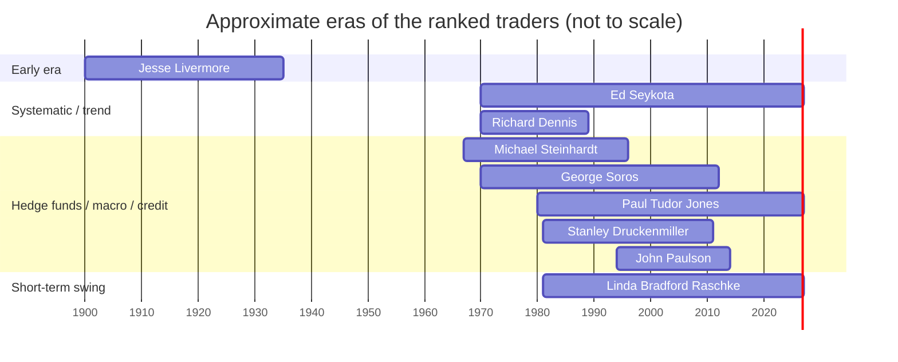

# Oracle of Great Traders for Tourab Crypto AI

## Executive summary

This file distills **risk management, strategy structure, and behavioral traits** from widely documented “top traders” into **actionable heuristics** for **Tourab Crypto AI**, a **local, supervised** crypto spot operator connected to entity["company","OKX","crypto exchange platform"]. It is designed to support **proposal → risk gatekeeper → human approval → execution**, not autonomous trading. (Also: no promises; markets don’t sign SLAs.)

The “Top 10” ranking below is **inherently subjective**: history is affected by survivorship bias, data availability, and the fact that many great traders are private. Rankings here are based on a blend of **documented performance**, **influence**, and **quality of publicly verifiable lessons** (books/interviews/reputable reporting). citeturn14news41turn14search6

A key constraint for your use case: with **$50**, **fees, spreads, and variance** dominate outcomes. For Tourab, the most transferable edge from the great traders is **not their specific entries**, but their **risk-first discipline**, **position-sizing humility**, and **operational rigor** (logging, review, and stop conditions). citeturn7search1turn7search5turn7search8

## Scope, constraints, and how to use this oracle

Tourab Crypto AI should treat this oracle as **a decision-support checklist**, not as predictive authority. Your agent should:

- **Prefer inaction** over low-quality action: if the setup is unclear, the “trade” is **no trade**. This fits the Market Wizards theme that longevity and discipline matter more than constant activity. citeturn14search6turn9search8  
- **Avoid leverage in v0**: many of the historical wins below used derivatives and leverage (macro/currency/credit). Those mechanics do **not** map safely to a $50 crypto experiment. citeturn2search0turn4search22turn12search5  
- **Internalize OKX friction**: OKX spot fees are **tiered maker/taker** (e.g., commonly ~0.08% taker visible on the OKX fees page; discounts and tiers apply). citeturn7search1turn7search9 Fees for spot can be charged in the **base currency** (example: if trading BTC/USDT, fees charged in BTC). citeturn7search5  
- **Always query tradability constraints per instrument**: OKX’s instrument configuration fields include `tickSz`, `lotSz`, and `minSz` (minimum order size in base currency for spot/margin). Tourab must query `/api/v5/public/instruments` and enforce these. citeturn7search8turn7search4  

## Top traders ranked with comparison table

Ranking notes: (a) performance numbers are often **estimates** and can vary by source; (b) “wins/losses” highlight **publicly documented** events; (c) some “losses” are included deliberately to counter hero-worship. citeturn15search2turn2search0turn4search16turn12search0

| Rank | Trader | Era (approx) | Primary markets | Signature win (documented) | Notable loss / drawdown (documented) | Style tag |
|---:|---|---|---|---|---|---|
| 1 | entity["people","Jim Simons","rentech founder"] | 1978–2024 | Systematic multi-asset | entity["company","Renaissance Technologies","quant hedge fund"]’s Medallion described as averaging **60%+ annually for decades** (reported). citeturn15search2turn3news39turn3news38 | Renaissance public institutional funds have seen major drawdowns (example: large October losses reported). citeturn6search6 | Quant / automated |
| 2 | entity["people","George Soros","quantum fund founder"] | 1970s–2010s | Global macro, FX | Profit of **about $1B** on 1992 sterling devaluation (“Black Wednesday”), via selling borrowed GBP and buying back after devaluation. citeturn2search0turn2search16 | Russian crisis losses described as **up to $2B** (1998). citeturn10search2 Also reported tech-bubble losses around **$700M** (1999). citeturn11search3 | Reflexive macro |
| 3 | entity["people","Stanley Druckenmiller","duquesne founder"] | 1981–2010 | Global macro | entity["company","Duquesne Capital Management","hedge fund firm"] reported **~30% average annual return over decades** with **no losing year** (per Reuters, 2010). citeturn4search16 | Documented personal “FOMO” mistake: buying tech late in 2000 led to a reported **$3B loss** over weeks (quoted transcripts/coverage). citeturn11search0turn11search8 | High-conviction macro |
| 4 | entity["people","Paul Tudor Jones","tudor investment founder"] | 1980–present | Macro, futures, equities | entity["company","Tudor Investment Corporation","asset management firm"] described as returning **125.9% after fees** in 1987 crash trade, earning an estimated **$100M**. citeturn13search9 | Macro has had “frustrating several years,” and a Tudor portfolio was shuttered; Reuters reports some Tudor returns below earlier peaks. citeturn13search21turn13search15 | Defensive macro |
| 5 | entity["people","Michael Steinhardt","hedge fund manager"] | 1967–1995 | Event-driven, macro equity/bonds | Hedge fund run 1967–1995 reported **24.5% average annual return** (even after incentive fees). citeturn6search3turn16search0 | Funds suffered **huge losses in 1994 bond market collapse** (reported contemporaneously). citeturn16search0turn16search13 | “Variant perception” |
| 6 | entity["people","Ed Seykota","trend-following trader"] | 1970s–present | Systematic trend | Reported turning a **$5,000** account into **$15M** over ~16 years, with rules emphasizing cutting losses. citeturn4search11 | Trend systems inherently experience **many small losses and periodic drawdowns**, and Seykota emphasizes system time constants and regime shifts. citeturn12search2turn12search13 | Systematic trend |
| 7 | entity["people","Richard Dennis","turtle trader"] | 1970s–1988 | Futures trend | Reported turning a **$1,600 loan** into about **$200M** and training the “Turtles” in trend following. citeturn12search18turn5search10 | Reported significant losses around the 1987 crash, followed by stepping back from trading for years. citeturn12search14 | Rules-based trend |
| 8 | entity["people","John Paulson","paulson & co founder"] | 1990s–2010s | Credit/event-driven | Subprime housing bet described as earning **$15B** for his firm in 2007 and “greatest trade” framing in book/publisher materials. citeturn4search22turn4search18turn1search11 | Major drawdowns later: Reuters reported a main fund down **30%+** in 2011. citeturn12search0turn12search8 | Asymmetric credit |
| 9 | entity["people","Linda Bradford Raschke","swing trader"] | 1981–present | Short-term swing (multi-market) | Decades-long professional career; emphasizes preparation and pattern-based swing setups; advises starting small because losses are “tuition.” citeturn16news39turn15search11 | Publicly emphasizes that beginners **will lose** and must size down; her core risk lesson is survival through inevitable mistakes. citeturn16news39 | Pattern-based swing |
| 10 | entity["people","Jesse Livermore","early 1900s speculator"] | ~1900–1934 | Stocks (tape reading) | Reported making about **$100M** on 1929 crash (often cited). citeturn6search0turn6search12 | Multiple bankruptcies; died in 1940 after losing fortunes—classic warning about leverage/overtrading. citeturn6search12turn5search3 | Tape-reading / momentum |

## Strategies, risk management, and behavioral traits

Below: concise, implementation-minded summaries. Where precise “entry/exit rules” are not public (common for institutional traders), the strategy description is constrained to what is **documented** and what is **reasonably inferable** from reputable reporting and primary writings.

**Jim Simons** — **Strategy**: automated, statistical, multi-asset, high-diversification approach; systematically exploited patterns using teams of scientists rather than discretionary decision-making. citeturn15search2turn15search16 **Entry/exit rules**: proprietary; not reliably public—Tourab should not attempt to “copy Medallion,” but can copy the *process*: hypothesis → data → test → risk constraints. citeturn15search2 **Timeframe**: typically shorter-horizon systematic trading (details remain guarded). citeturn15search2turn3news39 **Leverage**: institutions often use leverage; not appropriate for a $50 spot bot. citeturn3news39 **Risk controls**: breadth of bets + automation + strict statistical validation is the headline; note that non-Medallion public funds can still experience large drawdowns, reinforcing that “quant” ≠ “no risk.” citeturn6search6turn15search2 **Behavioral traits** (inferred from documented culture): scientific humility, focus on measurement, and strong process discipline. citeturn15search16turn15search2

**George Soros** — **Strategy**: discretionary global macro, using reflexive feedback loops (beliefs ↔ fundamentals) and willingness to change views quickly when facts/price action contradict. citeturn7search2turn10search17 **Signature trade mechanics**: pre-1992 sterling short described as selling borrowed GBP ahead of devaluation and buying back after, producing about $1B profit. citeturn2search0turn2search16 **Timeframe**: days to months (macro). **Leverage**: commonly used via borrowed money/derivatives; also a key reason losses can be large. citeturn2search0turn10search2 **Risk controls**: the best-supported “rule” from accounts is asymmetric P&L awareness—being wrong is fine; being wrong *big* is not—yet Soros still experienced very large drawdowns (Russia 1998; tech 1999). citeturn10search2turn11search3turn11search9 **Behavioral traits**: intellectual flexibility and willingness to reverse (contrasted with “thesis addiction”). citeturn10search17turn7search2

**Stanley Druckenmiller** — **Strategy**: macro with a bias toward high-conviction, opportunistic positioning; famous for “when you see it, bet big,” but under a strong risk framework (long record of compounding with no losing years at his fund, per Reuters). citeturn4search16 **Entry/exit**: thesis-driven macro timing plus price/flow confirmation (public details vary); what *is* clearly documented is that position size is central to outcomes and mistakes can be catastrophic when discipline slips. citeturn11search5turn4search16 **Notable failure mode**: tech-bubble FOMO leading to a reported $3B loss—useful as a cautionary tale: even elite traders break their own rules. citeturn11search0turn11search8 **Risk controls for Tourab to copy**: define a maximum loss, reduce size when “off,” and avoid emotional “I must play” impulses. citeturn11search0

**Paul Tudor Jones** — **Strategy**: discretionary macro and futures, with an explicit “defense first” mentality and strong anti-averaging-down stance. citeturn9search8turn9search0 **Entry/exit**: uses macro views + technicals; public documentation highlights rules rather than exact signals. citeturn9search8turn9search0 **Timeframe**: mostly swing-to-macro horizons (days to months), often via futures historically. citeturn13search9turn9search2 **Leverage**: often present in macro/futures contexts; Tourab should avoid. citeturn9search2 **Risk controls** (documented rules): “Don’t ever average losers” and “decrease volume when trading poorly; increase when trading well.” citeturn9search8turn9search0 **Signature win**: 1987 crash trade described as driving 125.9% after fees for Tudor and ~$100M profit. citeturn13search9 **Behavioral traits**: assumption that positions may be wrong (intellectual defensiveness), and adaptability (“evolve or die” theme in quote compilations). citeturn9search0

**Michael Steinhardt** — **Strategy**: concentrated, thesis-driven trading often framed as “variant perception” (finding where consensus is wrong), spanning equities and macro exposures across decades. citeturn6search3turn3search11 **Performance**: reported 24.5% annualized from 1967–1995 for his hedge fund. citeturn6search3turn16search0 **Key loss**: 1994 bond market collapse reportedly caused huge losses—a reminder that even long-term winners face brutal regimes. citeturn16search0turn16search13 **Entry/exit**: primarily thesis-driven; exits occur when thesis breaks or price action invalidates (publicly described at high-level). citeturn3search11 **Risk controls**: concentration plus active risk monitoring; Tourab should copy the *validation discipline* but cap concentration due to small account fragility. citeturn16search0 **Behavior**: intense commitment and high standards; also a caution on psychological stress and “always on” lifestyle. citeturn16search0turn3search11

**Ed Seykota** — **Strategy**: systematic trend following, rules-based, emphasizing frequent small losses and periodic large wins; often associated with early computer-driven systems. citeturn4search11turn12search2 **Signature win**: reported $5k → $15M track record and widely cited rules. citeturn4search11 **Entry/exit**: trend-following triggers (often moving-average or breakout families), exits via stops/trend reversal rules. (Exact parameters vary by system; do not cargo-cult.) citeturn12search2turn12search13 **Timeframe**: medium to long (days/weeks/months) depending on “time constant” (his framing). citeturn12search2 **Risk controls**: cut losses quickly; accept that “being wrong often” is normal; avoid psychological self-sabotage (“everybody gets what they want…”). citeturn16search7turn4search11 **Behavioral traits**: discipline, emotional detachment, and explicit self-awareness about why people trade. citeturn16search7

**Richard Dennis** — **Strategy**: classic commodity trend following; famous for proving that traders could be trained (“Turtles”) and for rules-based breakout-and-risk processes. citeturn12search18turn5search10 **Entry/exit**: breakout entries and stop-based exits are widely described in Turtle system accounts; risk is normalized across instruments using volatility-based sizing (e.g., “N/ATR” concepts). citeturn17search7turn17search3 **Leverage**: futures inherently embed leverage; Tourab should not replicate that. citeturn5search10 **Key win**: $1,600 → ~$200M reported; Turtle training influence. citeturn12search18turn5search10 **Key loss**: significant losses around 1987–1988 and stepping back from trading (reported). citeturn12search14 **Behavioral trait**: rule adherence—systematic detachment as a competitive advantage. citeturn12search18

**John Paulson** — **Strategy**: event-driven and credit, with a famous “asymmetric payoff” trade using CDS/credit structures against subprime mortgages. citeturn4search22turn4search18 **Entry/exit**: build a thesis from fundamentals and structural mispricing; express via instruments that offer convexity; hold through noise if thesis is intact. citeturn4search22turn4search18 **Key win**: widely cited $15B profit in 2007 for his firm. citeturn4search22turn1search11 **Key loss**: later years featured heavy losses; Reuters reported a main fund down over 30% in 2011 and severe drawdowns in broader portfolios. citeturn12search0turn12search1turn12search8 **Tourab translation**: don’t try to replicate credit-derivative trades; replicate the principle: look for asymmetric setups where downside is known and capped. citeturn12search5

**Linda Bradford Raschke** — **Strategy**: short-term swing trading built on (a) preparation, (b) tested price-behavior patterns, and (c) disciplined exits; emphasizes that durable success is about staying in the game. citeturn16news39turn14search15 **Entry/exit**: pattern setups (tests/retracements/climax-style behaviors are commonly described in analyses of her work) and fast invalidation via stops; timeframes range from intraday to weeks. citeturn16news39turn14search15 **Risk**: explicitly advises **starting very small** because losses are expected “tuition,” plus heavy emphasis on daily planning. citeturn16news39turn16search8 **Behavioral traits**: preparation, self-awareness, cognitive-bias management, and emotional regulation as “edge protectors.” citeturn16news39

**Jesse Livermore** — **Strategy**: tape-reading and momentum/speculation; pyramiding winners; strong emphasis (in the classic fictionalized account) on patience and waiting for the “line of least resistance.” citeturn14search9turn6search0 **Win**: often cited as making ~$100M during the 1929 crash. citeturn6search0turn6search12 **Loss/failure mode**: repeated boom-bust cycles, bankruptcies, and eventual collapse—livermore is the canonical story that “being right” isn’t enough if sizing, discipline, and lifestyle spiral out. citeturn6search12turn5search3 **Tourab translation**: keep the “wait for clarity” lesson; reject the “play huge / high leverage” temptation. citeturn14search9turn6search12

## Common principles across traders

Across wildly different methods (macro, quant, trend, swing, credit), a few principles recur:

Risk-first is non-negotiable. Great traders talk more about **not losing** than about winning. Paul Tudor Jones’ “don’t average losers” and “size down when trading poorly” captures the ethos. citeturn9search8turn9search0 Seykota’s framing emphasizes that discipline and loss-taking are part of the system, not a mistake. citeturn4search11turn16search7

Position sizing is the real throttle. Returns are often dominated by **how big you bet** when right/wrong, not by being right “more often.” Druckenmiller’s record and his public “big mistake” story both reinforce that sizing amplifies both brilliance and error. citeturn4search16turn11search0

Adaptability beats ideology. Soros is famed for a willingness to reverse and for views about perception and feedback loops; his record includes big wins and big losses, underscoring that adaptation is continuous. citeturn2search0turn10search2turn7search2

Edges are method-specific, but process is universal. Simons’ legacy is less “this indicator” and more “build measurement + automation + validation.” citeturn15search2turn15search16 Raschke’s longevity threads the same needle: tested patterns + preparation + disciplined risk. citeturn16news39turn14search15

Psychology is not motivational fluff; it is operational risk. Livermore is the enduring caution that mental state, lifestyle, and risk appetite can destroy a correct method. citeturn6search12turn5search3 Seykota’s “everybody gets what they want” warns that traders sometimes unconsciously optimize for excitement, not outcomes. citeturn16search7

## Practical heuristics for crypto spot trading on OKX

These heuristics are framed for **Tourab Crypto AI** operating in **crypto spot** (no leverage) on OKX under human supervision. They are **rules of thumb**, not guarantees.

**Heuristic: Treat fees + spread as the first opponent.**  
OKX spot fees are maker/taker tiered; small accounts get hit harder by turnover. Tourab should: estimate expected edge per trade and require it to exceed expected costs (fees + typical spread + slippage). citeturn7search1turn7search5  
Example: if taker fee is ~0.08% and you do a round trip (buy+sell), raw fee drag alone can approach ~0.16% (before spread/slippage). Don’t scalp pennies with a $50 account. citeturn7search1  
Caveat: actual fee tier depends on your account level and can change; always pull the current fee metadata and show it in the UI. citeturn7search12

**Heuristic: “Do nothing” is a valid action; enforce a trade-quality threshold.**  
Many top traders emphasize patience and selectivity (explicitly or implicitly). Tourab should encode: “if setup quality < threshold → propose HOLD.” citeturn14search6turn14search9  
Example: only allow a proposal when (a) regime condition is met (trend or range), (b) the entry has a defined invalidation level, and (c) expected loss is capped.

**Heuristic: Never average down losers (no martingale).**  
This is one of the most repeated risk rules in the literature and explicitly associated with PTJ: “Don’t ever average losers.” citeturn9search8turn9search0  
Crypto-specific note: averaging down can look “safe” in a chop, until it isn’t during a liquidation cascade (even in spot, your capital can be trapped in drawdown).

**Heuristic: Always define invalidation, not prediction.**  
Tourab should not “predict.” It should define: “What must be true for this trade to remain valid?” This is consistent with Soros/Druckenmiller/Jones-style adaptability: thesis breaks → exit. citeturn10search17turn11search0turn9search8  
Example: for a trend-following entry, invalidation could be “close back below the breakout level” or “price crosses below trailing stop.”

**Heuristic: Size by risk, then clamp by practicality.**  
Tourab should compute size from a risk budget and stop distance, then clamp to: (a) max notional, (b) max exposure, (c) OKX `minSz`/`lotSz`. citeturn7search8turn7search4  
Example: if the stop is 2% away and risk budget is $0.25, theoretical notional is $12.50. Then clamp to ≤$5–$10 (recommended for $50).  
Caveat: instrument min size may force larger-than-desired orders. If minimum trade size violates your risk budget, Tourab should propose HOLD. citeturn7search4turn7search8

**Heuristic: Prefer low-frequency, higher-signal trades in a $50 account.**  
High turnover is an edge-killer for small capital because fee drag is linear while your statistical edge is uncertain. This aligns with the “survive first” ethos repeated across Market Wizards-style lessons. citeturn14search6turn9search8  
Example: one trade per day (or fewer) is not “lazy”; it’s cost-aware.

**Heuristic: Log everything; review weekly; change slowly.**  
Quant legends emphasize measurement; discretionary legends emphasize journaling and learning from error. Tourab should have an immutable log and weekly review. citeturn15search2turn16news39  
Example review questions: “Did we violate any rules?” “Where did slippage occur?” “Did we trade without a clear invalidation point?”

## Anti-patterns, failure modes, and $50 risk limits

### Explicit anti-patterns and failure modes to avoid

**Martingale / doubling down**: “average losers” behavior is explicitly rejected by PTJ and is a common path to wipeout. citeturn9search8turn9search0

**Thesis addiction**: refusing to exit because “I’m right” is a recurring failure mode; Soros-style flexibility exists precisely because markets can stay irrational longer than your bankroll can stay intact. citeturn10search17turn11search3

**FOMO entries (late-cycle chasing)**: Druckenmiller’s most-cited mistake is essentially “I knew better, but I had to play,” producing huge losses. Small accounts cannot absorb this. citeturn11search0

**Over-trading in fee-heavy conditions**: OKX spot fees exist even if you “felt right.” A small bot that trades a lot is often just an expensive randomness generator. citeturn7search1turn7search5

**Ignoring exchange constraints (min size / lot size / tick size)**: sending invalid orders creates operational noise and, worse, encourages “panic tweaks.” Tourab must validate against `minSz`, `lotSz`, and `tickSz` before proposing. citeturn7search4turn7search8

**No reconciler**: assuming an order was canceled/filled without verifying open orders + fills is how bots drift into unintended exposure. (This is a practical lesson drawn from API trading best practice; Tourab must keep a ledger.)

**Security foot-guns**: never enable withdrawals on API keys; never store secrets in logs or repo; never “let the LLM hold the keys.” (Aligned with OKX key-permission model and general API security hygiene.) citeturn7search0

### Recommended $50 supervised risk limits

These limits are intentionally conservative because the goal is **learning + survivability**, not maximizing returns.

**Account-level limits (hard stops)**  
- Max daily loss: **$1.00** (2% of $50), then stop proposing trades for the day.  
- Max weekly loss: **$2.50** (5% of $50), then require manual review before re-enabling.  
- Max open exposure: **$10–$15 notional** total (20–30% of equity).  
- Max per-trade notional: **$5–$10** (10–20% of equity).  
Rationale: small enough that a string of errors doesn’t end the experiment; large enough to clear some minimum-order realities. (Always check `minSz`/`lotSz`.) citeturn7search4turn7search8

**Per-trade risk budget**  
- Risk per trade (R): **$0.25–$0.50** (0.5%–1.0% of equity).  
- Hard cap: never risk more than **$0.50** on a single trade in the prototype stage.  
Rationale: this mirrors the “defense-first” doctrine: protect capital while you learn execution and logging. citeturn9search8turn4search11

### Position sizing formulas Tourab can implement

**Fixed-fractional (stop-based) sizing**  
Let:  
- `E` = equity (USD)  
- `r` = risk fraction per trade (e.g., 0.005 to 0.01)  
- `s` = stop distance as a fraction (e.g., 0.02 for 2%)  
- `cap` = max notional per trade (USD), e.g., 10  

Then:  
- Risk budget in USD: `R = E * r`  
- Notional size: `N = min(cap, R / s)`  
- Base quantity: `qty = N / price`  
Then round `qty` to conform to OKX `lotSz` and ensure `qty >= minSz`. citeturn7search4turn7search8  

**Example (E=$50, r=1%, s=2%)**  
- `R = 50 * 0.01 = $0.50`  
- `N = min(10, 0.50 / 0.02) = min(10, 25) = $10`  
You risk ~2% move against you on a $10 position ≈ $0.20 before fees/slippage; if you want full $0.50 risk you’d need larger notional, but caps prevent it. (This is intentional.) citeturn7search1turn7search5

**Why not Kelly sizing for Tourab v0**  
The entity["people","John L. Kelly Jr.","bell labs scientist"] criterion maximizes expected log growth under assumptions like known edge and divisible capital; those assumptions do not hold for a brand-new crypto bot and a $50 account. citeturn17search1 Tourab should treat Kelly as theory, not as a production sizing tool.

## Prioritized sources and references

Primary sources (books/writings by traders or long-form interview series) and high-quality reporting are prioritized below. Citations are the clickable “links.”

- entity["book","Market Wizards: Interviews with Top Traders","jack schwager interviews"] by entity["people","Jack D. Schwager","author market wizards"] — cornerstone interview series that frames many of the discipline/risk lessons used here. citeturn14search6turn7search19  
- entity["book","The Man Who Solved the Market","gregory zuckerman book"] by entity["people","Gregory Zuckerman","journalist author"] — biography widely cited for Renaissance/Simons context and Medallion performance claims. citeturn3search1turn3news39  
- Reuters reporting on entity["people","Jim Simons","quant hedge fund founder"] and Renaissance culture/returns (high credibility baseline). citeturn15search2turn15search16turn3news39  
- entity["book","The Greatest Trade Ever","subprime short book"] by entity["people","Gregory Zuckerman","journalist author"] — publisher material and reviews summarize the Paulson subprime trade and its magnitude. citeturn4search22turn4search18  
- Reuters special reports on entity["people","John Paulson","paulson & co founder"] drawdowns post-2007 (critical for “heroes bleed too”). citeturn12search0turn12search1turn12search8  
- entity["book","The Alchemy of Finance","reflexivity theory"] by entity["people","George Soros","global macro investor"] — articulates reflexivity and includes market-thinking perspective. citeturn7search2  
- entity["organization","Encyclopaedia Britannica","reference publisher"] bio entry for Soros’ 1992 trade profit estimate (high-quality tertiary reference). citeturn2search0  
- Reputable reporting on Soros’ losses: Irish Times on 1998 Russia; Guardian on 1999 tech losses. citeturn10search2turn11search3  
- Reuters on entity["people","Stanley Druckenmiller","hedge fund manager"] career returns/no losing years; plus documented “big mistake” transcripts via reputable financial coverage. citeturn4search16turn11search0turn11search8  
- Business Insider compilations of entity["people","Paul Tudor Jones","global macro trader"] rules/quotes, with attribution to Market Wizards and direct quotes. citeturn9search8turn9search0  
- entity["book","No Bull: My Life In and Out of Markets","steinhardt autobiography"] by entity["people","Michael Steinhardt","hedge fund manager"] — primary autobiography reference point. citeturn3search11turn3search15  
- LA Times contemporaneous reporting on Steinhardt’s 1994 losses and long-term CAGR context. citeturn16search0  
- Business Insider profile of entity["people","Ed Seykota","system trader"] and his rules (plus Seykota’s own archived writings/quotes). citeturn4search11turn16search7turn12search2  
- Business Insider on entity["people","Richard Dennis","commodities speculator"] and the Turtle experiment; position-sizing concepts commonly summarized in Turtle literature. citeturn12search18  
- entity["book","Street Smarts: High Probability Short-Term Trading Strategies","raschke connors book"] by entity["people","Linda Bradford Raschke","professional trader"] and entity["people","Larry Connors","trader author"] — canonical short-term pattern/swing framework reference. citeturn14search15turn14search3  
- MarketWatch interview on Raschke’s preparation, swing timeframes, and “tuition” framing for new traders. citeturn16news39  
- entity["book","Reminiscences of a Stock Operator","edwin lefevre 1923"] by entity["people","Edwin Lefèvre","author reminiscences"] — fictionalized but influential Livermore-inspired narrative; useful for psychology and classic speculation errors. citeturn14search9turn14search1  
- OKX official technical docs for instrument constraints (`minSz`, `lotSz`, `tickSz`) and fee policy. citeturn7search4turn7search8turn7search1turn7search5  
- Kelly criterion primary paper: entity["people","John L. Kelly Jr.","bell labs scientist"] (1956). Used here only to justify *why not* to use Kelly sizing for Tourab v0. citeturn17search1  
- Practical Kelly discussion from entity["people","Edward O. Thorp","kelly criterion author"] for context on fractional betting and assumptions. citeturn17search17turn17search13